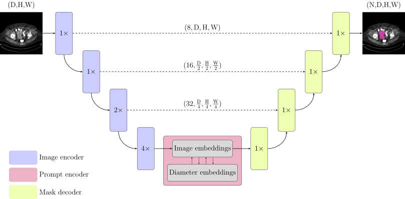

# Lite ENSAM: a lightweight cancer segmentation model for 3D Computed Tomography


[](https://openreview.net/forum?id=Ev0c6zrp9N)     [](https://www.python.org/downloads/release/python-31211/)

This repository is the official implementation of [Lite ENSAM](https://openreview.net/forum?id=Ev0c6zrp9N&referrer=%5Bthe%20profile%20of%20Agnar%20Martin%20Bj%C3%B8rnstad%5D(%2Fprofile%3Fid%3D~Agnar_Martin_Bj%C3%B8rnstad1)), submitted to the [MICCAI FLARE 2025 Task 1: Pan-cancer segmentation in CT scans](https://www.codabench.org/competitions/7149/#/pages-tab).


<div align="center">
<figure>
  
  <figcaption><b>Fig. 1.</b> The Lite ENSAM model architecture.</figcaption>
</figure>
</div>


## Environments and Requirements

Training environment 
- Debian 12
- CPU: Intel(R) Core(TM) i9-14900KF
- RAM: 2×48 GB; 4800 MT/s
- GPU: NVIDIA GeForce RTX 5090 32 GB
- CUDA version 12.9
- Python 3.12


(Optional): Create a Python 3.12 virtual environment and source it:

```
python3.12 -m venv venv && source venv/bin/activate
```

To upgrade pip and install requirements:

```
python3 -m pip install --upgrade pip && python3 -m pip install -r requirements.txt
```


## Dataset

The [FLARE task 1 PancancerRECIST to 3D](https://huggingface.co/datasets/FLARE-MedFM/FLARE-Task1-PancancerRECIST-to-3D) dataset is used exclusively for model training and validation.

1. Download the dataset:
    ```
    python3 download_flare25_task1_subtask2.py
    ```


2. Structure the downloaded dataset, append '--copy' if you want to copy instead of moving the downloaded dataset to the correct filestructure:
    ```
    python3 structure_dataset.py
    ```

## Training and finetuning

1. To train the model in the paper:

    ```bash
    python3 -m src.train_ahus_model
    ```


2. To fine-tune the model on a customized dataset:
    1. The data must have the follow folder structure:
        - For train: `./dataset/[DATASET_NAME]/train/[IMAGING_MODALITY]/[DATASET_TYPE]/[CASE_NAME].npz`
        - For val: `./dataset/[DATASET_NAME]/val/[IMAGING_MODALITY]/[DATASET_TYPE]/[CASE_NAME].npz`
    2. Start the fine-tuning:
        ```bash
        python3 -m src.train_ahus_model --train_dir <path_to_dataset> --checkpoint pretrained_models/lite_ensam_flare25.pth
        ```


## Inference

-  To infer the testing cases using the local python interpreter:

    ```python
    python3 -m src.submission.ahus_predict --load_path <path_to_data> --save_path "lite_ensam_outputs" --model_checkpoint "pretrained_models/lite_ensam_flare25.pth" --model_type "ahus_model_rope_mixed" --segmenter_type "original" --segmenter_device "cpu" --model_device "cpu"
    ```

- To infer the testing cases using Docker:
    1. Build the docker container:
    ```bash
    cp pretrained_models/lite_ensam_flare25.pth submission_files/weights.pth
    docker build . -t ahus_flare25:latest
    ```
    2. Run the docker container:
    ```bash
    docker container run -m 8G --name ahus_flare25 --rm -v <path_to_data>:/workspace/inputs/ -v $PWD/lite_ensam_outputs/:/workspace/outputs/ ahus_flare25:latest /bin/bash -c "sh predict.sh"
    ```

## Results

Our method achieves the following performance on [FLARE-MedFM/FLARE-Task1-PancancerRECIST-to-3D](https://huggingface.co/datasets/FLARE-MedFM/FLARE-Task1-PancancerRECIST-to-3D):


<div align="center">

| Model name       |  DICE  | NSD    |
| ---------------- | :----: | :----: |
| Lite ENSAM       | 76.06% | 78.99% |

<figure>
  
  <figcaption><b>Fig. 2.</b> Qualitative performance on the validation data.</figcaption>
</figure>

</div>


## Contributing

The repository is licensed under the [APACHE 2.0 LICENSE](LICENSE).


## Acknowledgements
We thank all data owners for making the CT scans publicly available and CodaLab for hosting the challenge platform. The authors express their appreciation to Novartis Norge AS and Akershus University Hospital for funding this work.

# Citations
If you find this repository useful, please consider citing our paper:
```
@inproceedings{bjornstad2025lite,
  title={Lite ENSAM: a lightweight cancer segmentation model for 3D Computed Tomography},
  author={Bj{\o}rnstad, Agnar Martin and Stenhede, Elias and Ranjbar, Arian},
  booktitle={MICCAI 2025 FLARE Challenge},
  year={2025},
  url={https://openreview.net/forum?id=Ev0c6zrp9N}
}
```

